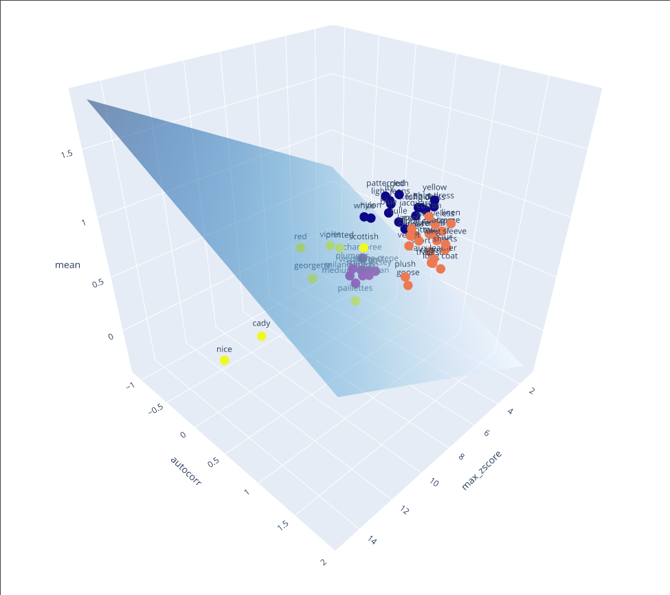
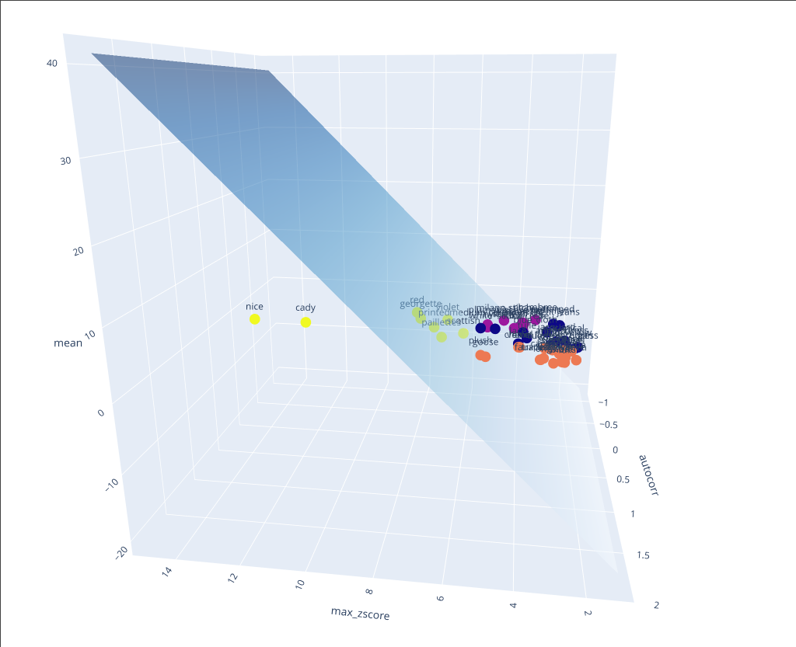
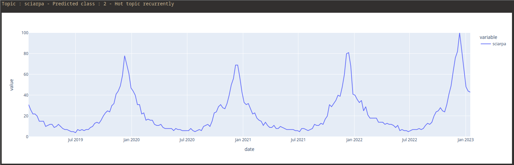

# How to run the code

```
git clone https://github.com/LorenzoMioso/TimeseriesClassification.git
cd TimeseriesClassification
pip install -r requirements.txt
jupyter notebook src/main.ipynb
```


The code is explained in the notebook `src/main.ipynb` file.

# Goal

Given a dataset of time series from Google Trends, the goal is automatically to understand if and how a topic is "hot" :

- Is not hot
- Is always hot
- Is hot for a single time
- Is hot recurrently

# Characteristics of data

The data is downloaded from Google Trends and is composed of a set of time series,
each one representing the popularity of a topic with a value between 0 and 100.

The data is collected over 4 years with a sampling frequency of one value every week.

The data is located in the `data/gtrends.csv` file.

## Graphing some representative time-series

Here we plot a time for each class :

- Not hot
- Always hot
- Hot for a single time
- Hot recurrently

| | |
|---------------------------------|------------------------------------|
| Hot topic                       | Not hot topic                      |
|  |       |
| Hot recurrently                 | Hot for one time                   |
|    |  |

# Feature extraction

## Some obvious choices of features

Some obvious choices of features are :

- `Mean`:
  It's obvious to notice that a topic is hot if the mean of the time series is high.

- `Standard deviation`:
  A time series with a high standard deviation is more likely to be hot recurrently.

  A time series with a low standard deviation could be hot, not hot or hot for a single time.

- `Autocorrelation coefficient (Pearson's)`:
  It is a measure of the correlation between a time series and a lagged version of itself.

  It is the perfect feature to detect if a time series is hot recurrently.

  In this case, we reach the maximum autocorrelation with a lag of 1 year.

## A not-so-obvious feature

We need a feature that can detect if a time series is hot for a single time.

With the previous features, we can't do that.

We are not able to distinguish between a time series that is hot for a single time and a time series that is not hot.

Both have a low standard deviation, low autocorrelation coefficient and a low mean.

But we can do that with the following feature:

- `Maximum z-score`:
  It is the maximum value of the z-score of the time series.

  The z-score is the number of standard deviations by which the value of an observation or data point is above the mean value of what is being observed or measured.

  This feature does not detect if a time series is hot for a single time exactly, but it is a good approximation.

  We can see that a time series that is hot for a single time has a high maximum z-score.


## Feature selection

So we choose to use the following features:

- Mean
- Autocorrelation coefficient (Pearson's)
- Maximum z-score of the time series

Here is a table that summarizes the features of each class:

|                       | Mean   | Autocorrelation | Max z-score |
| --------------------- | ------ | --------------- | ----------- |
| Hot                   | high   | medium/low      | low         |
| Not Hot               | low    | low             | low         |
| Hot recurrently       | medium | high            | medium/low  |
| Hot for a single time | low    | low             | high        |

## Graphing features


## Labeling data

This step is very important because it impacts how the model will classify the data.

Ultimately, is here where I decide what is the meaning of a class, for example, when above a certain threshold, a time series is hot.

Most of the data has been labeled manually by looking at the graph of the time series.

The only data that has not been labeled is that which had mixed behavior and I was not able to decide which class it belongs to.

In the file `data/labeled.csv`, there are labels assigned to each time series.

Each time series referred to by its topic name has been labeled with one of the following labels:

- 0: Hot topic
- 1: Not hot topic
- 2: Hot topic recurrently
- 3: Hot topic for a single time
- -1: Not classified

## Plotting all labeled data


## Plotting labeled data except for class -1 (not classified)


# Model selection (SVM)

Here are listed some considerations that could help us to choose the best model:

- The number of data points is small, less than 100.
- Inevitably each feature assumes a different scale and normalization is not possible for all features.

  For example, the maximum z-score theoretically has values that can go up to +infinity.

- The data shape of the classes does not resemble a particular distribution,
  data of class 3 is quite sparse.

## Why use an SVM

From the considerations above, using a generative model would not be a good idea.

Because the data is and we don't want to constrict points in a particular distribution (class 3 problem).

## Graphing separation planes learned by the SVM

Here we show some of the separation planes learned by the SVM.

The first one is the one that separates the data of classes 1 and 2 or 3.



The second one is the one that separates the data of class 3 from the other classes.



# Some results
Topic:  `sciarpa`, Prediction :  `Hot topic recurrently`


Topic :  `rosso`, Prediction :  `Hot topic`


Topic : `1 gennaio 2022`, Prediction : `Hot topic for a single time`
